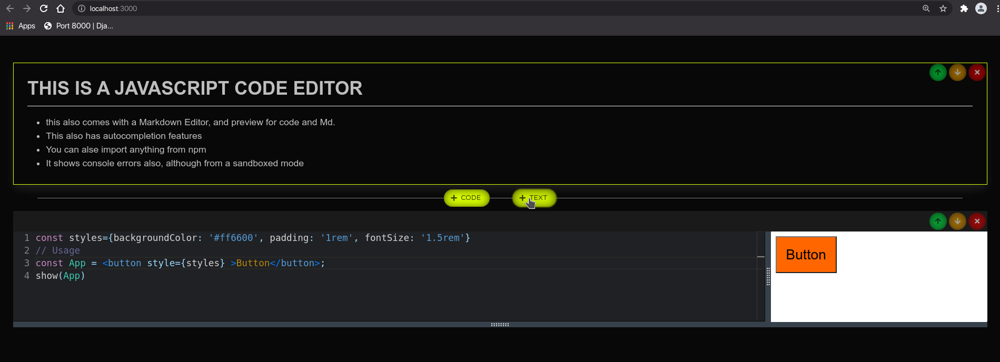

# A JAVASCRIPT CODE EDITOR MADE IN REACT

- It's perhaps one of the best editor made for on-the-go Web App Development.
- It's 100% responsive and can work on tablet, phone and laptop alike.
- This has the functionality of Jupyter notebook, with features that give this close resemblance.
- It's super optimized for coding on small screen devices, has limited but useful features.
- Made for mobile in mind, and is one of a kind of product in market.
- Made with React for web developers, with world class editor and auto-completions and auto-formatting.